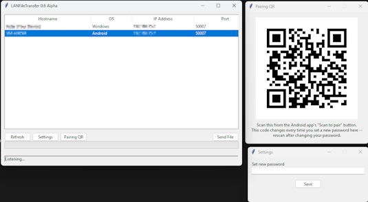
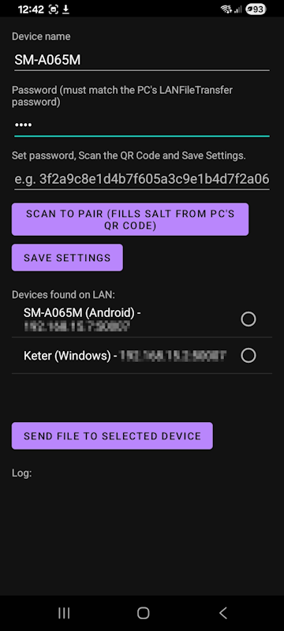

# LANFileTransfer

Lightweight, cross-platform LAN file transfers with automatic discovery and integrity verification. **direct file transfers between computers connected to the same local WiFi or Ethernet network**.

Unlike cloud storage or internet-based file sharing services, LANFileTransfer transfers files **directly through your local router (LAN)**. Files never leave your local network, resulting in faster transfers, improved privacy, and no internet bandwidth usage.


---

## Features

- Automatic device discovery using Zeroconf (Bonjour/mDNS)
- Cross-platform support
  - Windows ✅
  - macOS ✅
  - Android (experimental) ✅
- Direct file transfers over the local network
- SHA-256 integrity verification after every transfer
- HMAC-based authentication using a shared security code
- Protocol version checking for compatibility
- Custom protocol identifier to reject non-LANFileTransfer traffic
- Automatic handling of duplicate filenames
- Progress bar during transfers
- Lightweight graphical interface (Tkinter)
- Configurable security password
- No account sign up
- No cloud services
- No internet connection required after devices are connected to the same LAN

---

## How it Works

1. Launch LANFileTransfer on two computers connected to the **same router/Wi-Fi network**.
2. Devices automatically discover each other using Zeroconf.
3. Select a device from the list.
4. Choose a file.
5. The file is transferred **directly over the local network**.

```
Computer A
      │
      │
      ▼
 Local Router (WiFi/Ethernet)
      ▲
      │
      │
Computer B
```

No data is uploaded to the internet.

---

## Screenshots

Desktop



Android




---

## Architecture

```
   Desktop App
        │
        │
Zeroconf Discovery
        │
        ▼
  TCP Connection
        │
        ▼
  Custom Protocol
        │
        ▼
HMAC Authentication

        │
        ▼
SHA-256 Verification
        │
        ▼
  File Transfer
```
---

## Android Pairing

The Android client can pair with the desktop application by scanning a QR code generated by the desktop version.

The QR code contains the information required to derive the same shared authentication key without manually typing configuration values.

---
## Security

LANFileTransfer includes several security mechanisms to ensure only compatible clients can communicate and that transferred files remain intact.

### Authentication

- Shared security password
- HMAC-SHA256 authentication
- Random nonce for every connection

The shared password is **never transmitted across the network.**

### Integrity

Every transferred file is verified using SHA-256.

The receiver computes the file hash after the transfer and compares it with the sender's hash to detect corruption or incomplete transfers.

### Protocol Validation

Every control packet includes:

- Protocol identifier (magic bytes)
- Protocol version

This prevents unrelated TCP clients from communicating with LANFileTransfer.

### Reliability

- TCP sockets
- Socket timeouts
- Automatic duplicate filename handling
- Large file support

---

## Requirements

Both computers must:

- Be connected to the **same local network**
- Have LANFileTransfer running
- Allow local network connections through the operating system firewall

Internet access is **not required** for transferring files.

---

## Current Limitations

- One transfer at a time
- Files are saved in the application's directory
- Destination folder cannot yet be configured
- Linux support hasn't been tested.

---

## Technologies Used

- Python 3.12+
- Tkinter
- Zeroconf (Bonjour / mDNS)
- TCP sockets
- HMAC-SHA256
- SHA-256
- PyInstaller

---

## Building

Clone the repository:

```bash
git clone https://github.com/gustavo-eiji/LANFileTransfer.git
cd LANFileTransfer
```

Install dependencies:

```bash
pip install -r requirements.txt
```

Run:

```bash
python main.py
```

---

## Packaging

### Windows

```bash
pyinstaller --windowed --onefile main.py
```

### macOS

```bash
pyinstaller --windowed --onefile main.py
```

---

## Roadmap

- Better error reporting
- Transfer cancellation
- Drag & Drop support
- Folder transfers
- Resume interrupted transfers
- Transfer speed indicator
- Estimated time remaining
- Automatic updates
- Linux support
- End-to-end encryption

---

## Why LANFileTransfer?

Many file-sharing applications rely on cloud storage, third-party servers, or internet connectivity.

LANFileTransfer is designed to transfer files directly between computers on the same local network.

Benefits include:

- Faster transfers on modern LANs
- No cloud uploads
- No internet bandwidth usage
- Greater privacy
- Minimal setup
- Cross-platform compatibility

Transfer speed is limited primarily by your local network hardware (Wi-Fi or Ethernet) rather than your internet connection.

---

## License

This project is licensed under the MIT License.

See the LICENSE file for details.

---

## Disclaimer

LANFileTransfer is currently in active development.

Although it already implements authentication, integrity verification, and protocol validation, it should still be considered Alpha software.

Bug reports, feature requests, and pull requests are always welcome.